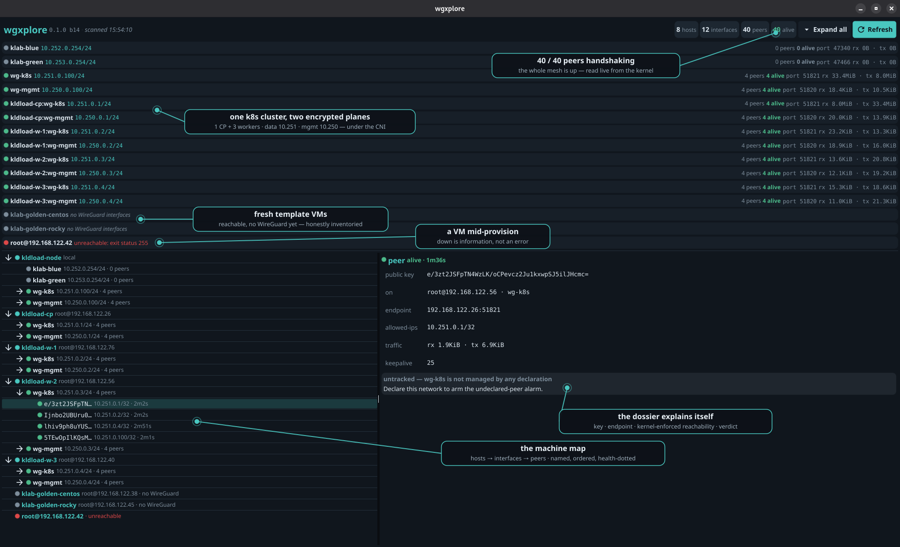

<div align="center">

<h1>
  
  &nbsp;wgxplore
</h1>

**The management layer WireGuard never shipped — in the open, not on top.**

*Every device, every peer, every network — declared in a file, enforced by the kernel, visible at a keypress.*

[](LICENSE)


**The family:** [kldload](https://github.com/kldload/kldload) — the substrate &middot; [zxplore](https://github.com/zxplore/zxplore) — the ZFS console &middot; **wgxplore** — the WireGuard console



</div>

**What you're looking at** — one hypervisor, photographed from the kernel,
minutes after installing itself:

- **A Kubernetes cluster on an encrypted backplane.** `kldload-cp` and
  workers `w-1/w-2/w-3` are KVM VMs, each on *two* WireGuard planes —
  `wg-k8s` (`10.251.0.0/24`, the data plane the CNI rides) and `wg-mgmt`
  (`10.250.0.0/24`: SSH, kubelet↔API, etcd). Every card top-right shows
  its port and live rx/tx; **40 peers, 40 alive** in the header means the
  full node mesh is handshaking. All k8s traffic between these nodes is
  kernel-encrypted *underneath* the cluster — the CNI never knows.
- **VMs in every state of life.** Two freshly-built template VMs
  (`klab-golden-centos`, `-rocky`) show dim — reachable, *no WireGuard
  yet*, honestly inventoried rather than hidden. One VM mid-provision
  shows red — `unreachable`, at the bottom, because down is information.
- **The dossier explains itself.** A selected peer shows its key,
  endpoint, allowed-ips (the kernel-enforced answer to "what may this key
  reach"), live traffic, and a verdict: this interface is *untracked* —
  declare it, and any peer nobody added starts rendering in alarm pink.
- Hosts are sorted and named by identity, with the ssh target demoted to
  a detail; the console found all of this by reading `wg show` over plain
  ssh — the machines run no agent.

`wgxplore` is a fast, keyboard-driven console for the WireGuard you already
run. Declare networks in a file, attach anything to them — hosts, VMs,
**running containers** — and see your whole estate in one tree: every
machine, every peer, handshake-fresh or stale, declared or **not declared
by anyone**.

It's a **primitives** tool, not a config manager. Every action maps to a
plain `wg`/`ip` command; nothing is hidden and nothing is invented. Three
ideas, no moving parts:

1. **The kernel is the truth.** The estate view is `wg show all dump` read
   back — locally and over the ssh you already have, in parallel across
   every host in your inventory. The console can't drift from reality
   because it *is* a fresh read of reality, every refresh.
2. **Every mutation is a command you could have typed.** `net up` prints
   `ip link add` · `wg setconf` · `ip addr add` · `ip link set up` and then
   runs exactly that. No daemon, no server, no agent — what wgxplore
   leaves behind is stock WireGuard, administrable with `wg` alone if you
   uninstall it tomorrow.
3. **The declaration exists so reality can be checked.** A network is one
   small file — subnet, topology, members — not because YAML is the point,
   but because intent has to live *somewhere* for the console to diff
   against. A peer on a managed interface that no file lists renders
   **UNDECLARED** in alarm pink: a WireGuard peer cannot appear by
   accident, so `wgx estate | grep UNDECLARED` is a real, cron-able
   control.

Sister project to [zxplore](https://github.com/zxplore/zxplore) (same
console, one domain over: ZFS) — and when both are present, wgxplore is
the road zxplore's replication travels: kernel-encrypted, to overlay
addresses that never change.

## Sixty seconds, whole network

```
# declare a lab: one reachable hub, spokes join from anywhere
wgx net create lab --subnet 10.99.0.0/24 --topology hub-spoke
wgx net add lab hub --hub --endpoint hub.example.net:51820
wgx net add lab ct1
wgx net render lab                # one plain .conf per member
wgx net up lab hub                # echoes: ip link add · wg setconf · ip addr · ip link set up

# give a RUNNING container exactly one network: yours
podman run -d --network none --name job untrusted-image
wgx attach lab job ct1            # moves a wg interface INTO its netns

# see everything
wgx                               # the console (GUI, or TUI over ssh)
wgx estate                        # the same tree as text, for scripts and cron
```

The attach is the kernel trick worth knowing: a WireGuard interface's
encrypted socket stays anchored in the namespace where it was *created*,
so wgxplore configures it on the host, then moves it into the container —
no restart, no sidecar, no privileges. With `--network none`, the mesh is
the only network the workload has; spoke-to-spoke traffic dies in the
kernel because no key routes there.

More flows — the cross-site backplane, the zero-surface backup box, the
tripwire, joining a phone with its stock app — in
[docs/EXAMPLES.md](docs/EXAMPLES.md).

## Works with any WireGuard device

Interop runs both directions, because there's no agent and no wire
protocol of wgxplore's own:

- **It observes estates it didn't create.** If `ssh <host> wg show all
  dump` works — Linux, BSD, OpenWrt, a hand-rolled `wg0` from 2019 — it's
  in the tree. Hosts with no WireGuard at all still show, dim and honest.
- **Its networks accept any WireGuard implementation.** Rendered configs
  are standard `[Interface]`/`[Peer]`; a phone, MikroTik, or OPNsense box
  joins with its native tooling.

And all of it runs **underneath whatever networking you already have** —
declared subnets ride beside your LAN, beneath your apps and your CNI,
asking nothing else to change. New to WireGuard itself? The five-minute
primer: [docs/WIREGUARD.md](docs/WIREGUARD.md).

## Versus the alternatives

Everyone in this table moves packets as real WireGuard. The differences
are what's wrapped around the tunnel:

| | coordination plane | datapath | container attach | policy | plain-wg peers |
|---|---|---|---|---|---|
| Tailscale | SaaS + DERP relays | userspace | sidecar | ACL service | no |
| NetBird | own server | kernel | sidecar | server-side | partially |
| innernet / dsnet | own server | kernel | — | server-side | partially |
| wesher | gossip daemon per node | kernel | — | — | no |
| **wgxplore** | **none — a file** | **kernel** | **netns move** | **allowed-ips (kernel)** | **yes** |

The one-line map: wgxplore **competes** with the config managers,
**completes** everything that already speaks WireGuard, and **coexists**
with the SaaS meshes. The trade we accept: no CGNAT hole-punching, no
relays — one reachable UDP port runs an estate. The long-form boundaries,
strengths, weaknesses, and the workloads-as-datasets stack thesis:
[docs/POSITIONING.md](docs/POSITIONING.md).

## Scope: one thing, done well

wgxplore does **declared WireGuard, reconciled** — and will never grow a
daemon, database, broker, relay, or CNI. Adjacent wants are composition:
time-boxed access is `cron` + re-render, membership history is `git` on
`/etc/wgx`, alerting is the estate output in the monitor you already run.

Roadmap (only what sharpens the core): per-member key custody · fleet-grade
verbs (deterministic allocation, idempotent `net add`, `--json`) ·
`net adopt` · key rotation · audit log · joined networks.

## On kldload — and how to get the same anywhere

[kldload](https://kldload.com) is a kernel-loaded deployment: an installer
that puts ZFS on root across eight Linux distributions and, when you ask for
a cluster, brings the nodes up on a declared WireGuard backplane. wgxplore is
how you see that backplane, so it ships in every profile. On a fresh kldload
box these things are already **true**, not merely installed:

- The Kubernetes node mesh is encrypted WireGuard — two planes, one for the
  data path the CNI rides and one for management (SSH, kubelet↔API, etcd).
- The declarations and the estate inventory were written during bootstrap, so
  the first `wgx` you run already shows every node, interface and peer.
- A polkit rule is in place, so the console reads state without prompting on
  every refresh; the ingested commit is recorded in
  `/etc/kldload/wgxplore-commit`, and air-gapped builds ship it from cache.

Why it composes: on that substrate a VM disk and a container volume are ZFS
datasets, so a workload is a dataset plus an overlay address — replicate the
dataset over the mesh with [zxplore](https://github.com/zxplore/zxplore),
`wgx attach` it on the far side, and it comes up at the same address with its
data. Neither console is required for the other; together they are the road
and the payload.

**None of this is kldload-specific.** wgxplore is a static binary that talks
to your kernel and your ssh — nothing about it knows or cares which distro it
is on. To get the same on any Linux:

```
dnf install wireguard-tools     # or apt/pacman/apk
wgx net create mesh --subnet 10.44.0.0/24 --topology hub-spoke
wgx net add mesh hub --hub --endpoint hub.example.net:51820
wgx net add mesh node1
wgx net render mesh && wgx net up mesh hub
printf 'root@10.0.0.11\nroot@10.0.0.12\n' > ~/.config/wgx/hosts   # the estate
```

Point it at hosts that already run WireGuard and it maps those too, declared
by you or not. The kldload integration is a head start, not a dependency.

## Install

```
git clone https://github.com/wgxplore/wgxplore
cd wgxplore
make               # ./wgx (GUI+TUI, cgo/Fyne) and ./wgx-tui (static)
sudo make install
```

| binary | what | needs |
|---|---|---|
| `wgx` | native GUI (light/dark, follows the WM) + TUI + all verbs | cgo, OpenGL, X11/Wayland |
| `wgx-tui` | terminal-only, **fully static** | nothing — `scp` it anywhere |

Or straight from source — note the binary lands as `wgxplore`, so rename it
if you want the short name:

```
go install github.com/wgxplore/wgxplore@latest   # static TUI
mv "$(go env GOPATH)/bin/wgxplore" "$(go env GOPATH)/bin/wgx-tui"
```

<details>
<summary><b>GUI build dependencies per distro</b></summary>

```
# Fedora / RHEL / Rocky
sudo dnf install -y golang gcc pkgconf-pkg-config mesa-libGL-devel \
  libX11-devel libXcursor-devel libXrandr-devel libXinerama-devel \
  libXi-devel libXxf86vm-devel wayland-devel libxkbcommon-devel

# Debian / Ubuntu
sudo apt-get install -y golang gcc pkg-config libgl1-mesa-dev xorg-dev \
  libwayland-dev libxkbcommon-dev

# Arch
sudo pacman -S --needed go gcc pkgconf libgl libxcursor libxrandr \
  libxinerama libxi wayland libxkbcommon
```
</details>

Portability: the console and estate view need only `wg` and ssh, and the
static binary builds for Linux, FreeBSD, OpenBSD and NetBSD (amd64/arm64).
Two honest limits: **runtime testing to date is Linux** — the BSD binaries
are cross-compiled and reports are very welcome — and the *mutating* verbs
(`net up`, `attach`) shell out to `ip`, so on a BSD you get the estate view
and rendering while bringing interfaces up stays a job for `ifconfig` and
`wg setconf`. The container attach is Linux-only by nature: it moves an
interface between network namespaces.

Runtime: a kernel with WireGuard (mainline since 5.6) and `wg` on machines
you *mutate*; remote estate hosts need only `sshd` + `wg`. Remote hosts
come from `~/.ssh/config` or `~/.config/wgx/hosts` (one ssh target per
line), re-read on every refresh.

## Usage

```
wgx                # the console — native GUI, falls back to the TUI
wgx tui            # force the terminal console
wgx estate         # the whole estate as a text tree
wgx show           # peer dossiers, one-shot
wgx net create <name> [--subnet CIDR] [--topology mesh|hub-spoke] [--port N]
wgx net add <name> <member> [--endpoint host:port] [--hub]
wgx net render <name>
wgx net up <name> <member>
wgx attach <net> <container> <member>
```

**TUI keys:** `j`/`k` move · `/` filter · `r` refresh · `q` quit.
**GUI:** interface cards on top, estate tree left, dossier right;
auto-rescans every 30s; follows the OS light/dark theme live.

<!-- TUI screenshot slot — the one shot worth adding: same console over ssh

-->

## Security model

- **The console is read-only**; every mutation is an explicit CLI verb
  that echoes its exact `wg`/`ip` command first.
- **Policy lives in the kernel** (cryptokey routing) — no policy service
  to misconfigure or compromise; a scanner can't even see the port.
- **Reads escalate gently** — direct → `sudo -n` → `pkexec`; ssh host
  keys are pinned (`accept-new`); declarations are `0600`.
- **Prototype caveat, stated plainly:** member private keys currently
  live in the declaration file — treat `/etc/wgx` like a keystore.
  Per-member custody is the top of the roadmap.

## Documentation

- [docs/EXAMPLES.md](docs/EXAMPLES.md) — five worked flows, commands included.
- [docs/POSITIONING.md](docs/POSITIONING.md) — boundaries, trades, and the stack thesis.
- [docs/WIREGUARD.md](docs/WIREGUARD.md) — the protocol from first principles.
- [`man wgx`](docs/wgx.1) — the manual: verbs, options, files, exit status, caveats.

## Status

0.1.0 — engine, estate inventory, reconciliation, TUI, themed GUI.
BSD-3-Clause. See [LICENSE](LICENSE).
