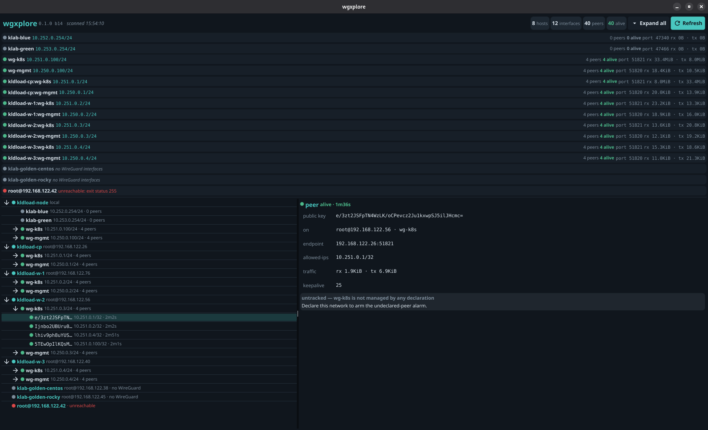

<div align="center">


# wgxplore

**A direct interface to your WireGuard estate — not a control plane.**

*Every device, every peer, every network — declared in a file, enforced by the kernel, visible at a keypress.*

[](LICENSE)


<!-- hero screenshot: GUI full window — estate tree, interface cards, peer dossier

-->

</div>

`wgxplore` is a fast, keyboard-driven console for the WireGuard you already
run. Sister project to [zxplore](https://github.com/zxplore/zxplore) — same
console shape, same primitives ethos, one domain over. Declare networks,
attach anything to them — hosts, **running containers via the kernel's netns
move**, VMs — and see the whole estate in one view: every device, every peer,
handshake-fresh or stale, declared or **not declared by anyone**.

Think of it as **a manager for the WireGuard protocol itself**. WireGuard
ships world-class primitives and — deliberately — no management layer: no
key distribution, no config orchestration, no fleet view. Its authors left
policy to userspace, and most of userspace answered by building products
*on top* that hide the protocol behind their own control planes. wgxplore
answers by managing the protocol **in the open**: every action maps to a
plain `wg`/`ip` command, echoed before it runs; no daemon, no SaaS, no
agent — membership is a file, policy is cryptokey routing, and what
wgxplore leaves behind is stock WireGuard you could have typed yourself.
Others build on WireGuard. **wgxplore's product *is* WireGuard, managed.**

---

## Suddenly, the hard stuff is a gesture

- **Your whole WireGuard estate is one screen.** Every interface on every
  ssh-reachable box — handshake health, traffic, ports — in one tree.
  Install nothing anywhere else.
- **An intruder peer cannot hide.** A key on a managed interface that no
  declaration lists lights up **UNDECLARED** in alarm pink. A peer cannot
  appear by accident — someone with root added it, and now you know.
- **Network-isolating a container is one command.** `wgx attach` moves a
  WireGuard interface *into* a running container — no restart, no sidecar,
  no privileges. Run it `--network none` and the mesh is all it has.
- **A whole VPN is three commands.** Declare, render, up. The declaration
  is a JSON file you can read, diff, and check into git.
- **A phone joins with its own app.** Members are plain WireGuard — any
  device that speaks the protocol joins with its native tooling.
- **ZFS replication rides the mesh at line rate.** Kernel crypto instead of
  ssh's single-core cipher: `zfs send | mbuffer` straight to a stable
  overlay address (the [zxplore](https://github.com/zxplore/zxplore)
  pairing).
- **The backup box has no public surface.** Hub-spoke it: reachable only
  over the mesh, addressable only by the peers the kernel routes.

And under every one of these: the literal `wg`/`ip` command it ran, printed
before it runs. Magic UX, zero magic.

## Things that used to be YAML archaeology

Every flow below is real, and under each is the exact command it runs —
because that's the contract: you could always have typed it yourself.

**Declare a lab and bring the hub up.**
```
# wgx net create lab --subnet 10.99.0.0/24 --topology hub-spoke
# wgx net add lab hub --hub --endpoint hub.example.net:51820
# wgx net add lab laptop
# wgx net render lab
# wgx net up lab hub
$ ip link add wgx-lab type wireguard
$ wg setconf wgx-lab /etc/wgx/lab/hub.conf
$ ip addr add 10.99.0.1/24 dev wgx-lab
$ ip link set wgx-lab up
```
Copy `laptop.conf` over, `wgx net up lab laptop` there, and `ping 10.99.0.1`
answers. Spokes have no ListenPort and roam freely; the hub is the only
address anyone must reach.

**Give a running container exactly one network: yours.**
```
# podman run -d --network none --name scraper myimage
# wgx attach lab scraper ct1
$ ip link add wgx-bGFic2Ny type wireguard
$ wg setconf wgx-bGFic2Ny /etc/wgx/lab/ct1.conf
$ ip link set wgx-bGFic2Ny netns 41337
$ nsenter -t 41337 -n ip addr add 10.99.0.3/24 dev wgx-bGFic2Ny
$ nsenter -t 41337 -n ip link set wgx-bGFic2Ny up
```
The container now owns a mesh interface it cannot escape — plaintext never
exists inside its namespace, and hub-spoke means it can reach the hub and
*nothing else*. (Why this works: [the netns move](#the-netns-move).)

**See everything, from anywhere.**
```
$ wgx estate
estate: 2 hosts · 2 interfaces · 3 peers · 3 alive

local
  ├─ wgx-lab  10.99.0.0/24  (2 peers)
  │  ├─ ● 10.99.0.2/32   —                       42s
  │  └─ ● 10.99.0.3/32   —                       8s

laptop
  ├─ wgx-lab  10.99.0.0/24  (1 peers)
  │  └─ ● 10.99.0.0/24   hub.example.net:51820   12s
```
Remote hosts come from `~/.ssh/config` (or `~/.config/wgx/hosts`); the far
side needs **nothing but `sshd` and `wg`**. Unreachable boxes stay in the
tree — "the box is down" is inventory, not an error.

**Catch the peer nobody added.**
```
$ wgx estate | grep UNDECLARED   # a real control, cron-able
```
The reconciliation is three states: declared + live → healthy · declared,
absent → never came up or host down · **live, undeclared → alarm**. The
alarm arms **per interface**: an interface is *managed* when its own key
appears in a declaration. Interfaces wgxplore merely observes (your
pre-existing `wg0`) read as neutral *untracked* — an adopted estate is
inventory, not a wall of false alarms.

**Join a device wgxplore will never run on.**
Give a phone / MikroTik / OPNsense its subnet address and the hub's `[Peer]`
block in its native UI, add its public key to the declaration, done — the
estate view now knows it belongs.

## How it works

wgxplore adds **no datapath and no daemon**. The overlay *is* kernel
WireGuard; wgxplore is three thin layers on top:

**1. Declare — the file is the API.** A network is one JSON file in
`/etc/wgx/<name>.json`: subnet, topology (`mesh` | `hub-spoke`), port,
members. `wgx net create`/`add` write it; you can also just edit it.
Nothing hides in a database — `cat` shows you the entire network.

**2. Apply — render to plain WireGuard, run the primitives.** `wgx net
render` compiles the declaration into one standard `.conf` per member.
**Topology is nothing but the peer list**: mesh renders everyone into
everyone's config; hub-spoke gives a spoke exactly one `[Peer]` — the hub,
carrying the whole subnet. Policy is therefore enforced by **cryptokey
routing in the kernel**: a spoke cannot address another spoke because no
key routes there. There is no ACL service to bypass, because there is no
service.

**3. Observe — read the kernel back, diff against the declarations.**
`wg show all dump` locally and over plain ssh on every inventory host, in
parallel, folded into one tree and coloured by handshake age; every peer
key checked against every declaration, on every interface whose own key a
declaration claims. The **UNDECLARED** row is the point.

After wgxplore runs, what you have is stock WireGuard — administrable with
`wg` alone, not dependent on wgxplore staying installed.

## The netns move

Linux runs many independent network stacks on one kernel — each *network
namespace* (netns) has its own interfaces, routes, firewall, sockets. A
container's "network isolation" is exactly this; `--network none` means its
netns holds nothing but loopback.

WireGuard interfaces have a property most tooling ignores: **the encrypted
UDP socket stays anchored in the namespace where the interface was
created**, even after the interface moves. `wgx attach` exploits exactly
that: create and configure the interface in the **host** namespace (the
socket anchors where the real NIC lives), move it into the container with
`ip link set … netns`, address it from inside via `nsenter`. Everything the
container sends is encrypted *by the kernel* before it exists anywhere else;
the container never touches the underlay. The same move works on any netns —
VMs bridged through one, or namespaces you built with `ip netns add`.

## Works with any WireGuard device

No agent, no wire protocol of its own, no lock-in format — interoperable in
both directions:

- **It observes estates it did not create.** If `ssh <host> wg show all
  dump` works — Linux, BSD, OpenWrt/VyOS, a hand-rolled `wg0` from 2019 —
  it's in the tree, health-coloured, reconciled. Pre-existing interfaces
  appear beside declared ones and the undeclared-peer alarm covers all.
- **Its networks accept any WireGuard implementation.** Declarations
  compile to standard `[Interface]`/`[Peer]` config; foreign devices join
  with their native tooling. (Rendered files are `wg setconf` format — no
  `Address=` line, because wgxplore applies addresses via `ip addr` so one
  file works before *and* after a netns move; a foreign device sets its
  address in its own UI, which it was doing anyway.)

No flag day: point wgxplore at what you have, declare what you add.

## Boundaries: vs Tailscale, NetBird, wesher

**What's the same is the wire** — all of these move packets as real
WireGuard: same Noise handshake, same cryptokey routing. Nobody here
invents cryptography. The differences are everything *around* the tunnel:

| | coordination plane | datapath | container attach | policy | plain-wg peers |
|---|---|---|---|---|---|
| Tailscale | SaaS + DERP relays | userspace (wireguard-go) | sidecar | ACL service | no |
| NetBird | own server | kernel (Linux) | sidecar | server-side | partially |
| innernet / dsnet | own server / registry | kernel | — | server-side | partially |
| wesher | gossip daemon per node | kernel | — | — | no |
| wg-quick by hand | none | kernel | — | allowed-ips | yes — it *is* plain wg |
| **wgxplore** | **none — a file** | **kernel** | **netns move, no sidecar** | **allowed-ips (kernel)** | **yes — renders plain wg** |

- **Tailscale** solves any-two-devices-anywhere through any NAT, zero
  config — at the cost of a SaaS control plane holding your ACLs, relays
  your packets may transit, and a userspace datapath. wgxplore trusts no
  third party and keeps userspace out of the path — and in exchange asks
  *you* for one reachable UDP port.
- **NetBird** is closest on the datapath (kernel WireGuard) but keeps a
  management server and per-node agents. wgxplore's "server" is a JSON
  file; its "agent" is the ssh you already have.
- **wesher** converges automatically via a gossip daemon on every member;
  membership is decided by gossip, not by a file you review. wgxplore
  chose the file.
- **innernet / dsnet** are the config-manager cousins — server-issued
  invites, kernel datapath, their formats on the members. Still a server
  and a database in the loop.
- **wg-quick by hand** is the baseline wgxplore refuses to abandon: the
  result *is* hand-rollable. wgxplore removes the N-configs-drifting, the
  blindness, and the trust — and adds the container attach, which no
  config manager does.

**The trade we accept:** no CGNAT hole-punching, no relay fleet. One
reachable UDP port runs an estate; two laptops behind hostile NATs are
Tailscale's problem, not ours. Membership propagates by re-rendering, not
gossip: deliberate, visible, file-shaped.

**The one-line map:** wgxplore *competes* with the config managers,
*completes* everything that already speaks WireGuard, and *coexists* with
the SaaS meshes — run one for your roaming laptop and wgxplore for the
estate you own, on the same day, without conflict.

## Where wgxplore sits

Draw the map honestly and the position is narrow and strong:

**Built for:** an estate you *own* — machines, VMs, containers, and at
least one reachable UDP port somewhere. Membership that changes monthly,
not hourly. Operators who want nothing in the trust chain but their file,
their kernel, and their ssh.

**Wrong tool for:** two roaming devices with no home base (that is
genuinely Tailscale's game); thousand-node fleets with hourly churn (run a
control plane, you'll need one); L2 overlays (WireGuard is L3 — no
broadcast, no VXLAN games).

**Strengths, concretely:**

- *Nothing to run, nothing to lose.* The "registry" is a file. Lose it and
  the estate still works — the kernel state is readable back.
- *Nothing in the datapath but the kernel.* No relay outage, no bandwidth
  ceiling set by someone else, no third party your packets transit.
- *Revocation is subtraction.* Remove the member, re-render: the kernel
  stops routing that key. No CRL, no token expiry to reason about.
- *The audit story is `git log /etc/wgx`.* Every membership change is a
  file diff made by a person.
- *The container attach.* No agent-based tool can do it: the workload gets
  the mesh without any process alongside it.

**Weaknesses, concretely:**

- *No rendezvous, no network.* If no member has a reachable port, nothing
  forms — there is no relay to save you.
- *Convergence is you.* Add a member at midnight and the estate learns at
  midnight only if you re-render at midnight.
- *Prototype key custody.* Today the declaration holds private keys —
  treat `/etc/wgx` like a keystore until per-member custody lands (top of
  the roadmap).

## Five ways to use it

The same four verbs — declare, render, up, attach — pointed at five
different problems.

### 1 · Two sites, one backplane: replicate live workloads across the internet

Two [kldload](https://kldload.com) systems, anywhere on the internet, one
declared network between them — and every layer above inherits it:

```
# on site-a (the reachable one)
wgx net create backplane --subnet 10.77.0.0/24 --topology hub-spoke
wgx net add backplane site-a --hub --endpoint a.example.net:51820
wgx net add backplane site-b
wgx net add backplane db-a          # containers get memberships too
wgx net add backplane db-b
wgx net render backplane && wgx net up backplane site-a
# on site-b: wgx net up backplane site-b, then attach the live containers
wgx attach backplane db-a db-a      # site-a
wgx attach backplane db-b db-b      # site-b
```

Two *running* containers on two different sites now share a private,
kernel-encrypted backplane that neither the sites' firewalls nor the
containers' own isolation can see into — `db-b` replicates from
`db-a:5432` at `10.77.0.3` as if they shared a rack. And because kldload
is a ZFS substrate, the composition goes further with primitives only:
container volumes are datasets, so **moving a workload between sites is
`zfs send` over the mesh** — snapshot on site-a, send at kernel speed
([zxplore](https://github.com/zxplore/zxplore) makes it two panes and a
confirm), start the container on site-b, `wgx attach` it, and it comes up
at the same overlay address with its data. Node-to-node k8s traffic,
etcd/NATS replication, golden-image distribution — anything that can
target an IP can ride the backplane.

### 2 · The workload that can reach exactly one thing

An agent, a scraper, a build job — something you want to *use* but not
*trust*. Give it no network at all, then attach it to a hub-spoke net
whose hub is the one service it may talk to:

```
wgx net create egress --subnet 10.66.0.0/24 --topology hub-spoke
wgx net add egress api --hub --endpoint api.internal:51820
wgx net add egress job
wgx net render egress
podman run -d --network none --name job untrusted-image
wgx attach egress job job
```

From inside: `10.66.0.1` answers, and *nothing else exists* — no default
route, no DNS, no underlay, and spoke-to-spoke traffic dies in the kernel
because no key routes there. This is not a firewall rule the workload
might find a way around; there is no other network **to** reach. Fully
compromised, the job can talk to the API it was already allowed to talk
to.

### 3 · The backup box that doesn't exist

An off-site backup target at a relative's house, behind their NAT, with
**zero open ports**. Make your home box the hub; the backup box is a
spoke that only ever dials out:

```
wgx net create vault --subnet 10.88.0.0/24 --topology hub-spoke
wgx net add vault home --hub --endpoint home.example.net:51820
wgx net add vault backup
wgx net render vault && wgx net up vault home
# at the relative's house, once: wgx net up vault backup
```

The spoke's `PersistentKeepalive` holds the NAT mapping open, so the hub
can always reach `10.88.0.2` — but from the internet's point of view the
backup box is not there: nothing listens, nothing answers, no port
forward exists. Nightly, from home:

```
zfs send -w -i @last tank/vault@today | ssh 10.88.0.2 zfs recv backups/vault
```

Encrypted datasets travel raw (`-w`) — the box stores what it can never
read, over a link only your keys can address.

### 4 · The tripwire

Declare your estate and the reconciliation loop becomes an intrusion
control. A WireGuard peer cannot appear by accident: cryptokey routing
means someone with root added that key. So watch for exactly that:

```
# monitoring, anywhere that can ssh the estate:
wgx estate | grep -q UNDECLARED && notify "rogue WireGuard peer"
```

Every declared interface on every host is checked against the
declarations on every scan — a key you didn't add lights up `⚠ UNDECLARED`
in the console and lands in that grep. Interfaces wgxplore doesn't manage
read as neutral *untracked* (inventory, not judgement), so the alarm only
ever means the one thing worth waking up for. (`wgx net adopt`, on the
roadmap, brings pre-existing interfaces under declaration.)

### 5 · The phone in your pocket

Members don't run wgxplore — they speak WireGuard. Add a phone to a
network and hand it its config through the app it already has:

```
wgx net add road phone
wgx net render road
qrencode -t ansiutf8 < /etc/wgx/road/phone.conf   # scan with the WG app
```

Add the address (`10.44.0.3/24`) in the app's interface screen — done:
the phone is on your estate's network with its native client, visible in
the estate view like every other peer, no app of ours anywhere near it.
The same flow is a MikroTik, an OPNsense box, or a colleague's
hand-rolled config — paste keys instead of scanning.

## Scope: one thing, done well

wgxplore does **declared WireGuard, reconciled**: a file describes the
network, primitives apply it, the console diffs reality against it. That
is the whole program. The Unix answer to everything adjacent is
*composition*, not features:

| you want | compose |
|---|---|
| time-boxed access | `cron` + `wgx net render` — prune the member, re-render |
| enrollment | `scp` the conf out, `wgx net add` the key back over ssh |
| membership history & review | keep `/etc/wgx` in `git` — the diff *is* the change request |
| networks up at boot | your init: a oneshot unit that runs `wgx net up` |
| alerting | `wgx estate \| grep UNDECLARED` in the monitor you already run |
| moving workloads | `zfs send` / `rsync` / `pg_basebackup` — over the mesh |

What wgxplore will **never** grow, because each one is a second thing: a
daemon, a database, a broker or identity service, relays or NAT
traversal, a CNI. The tools that made those choices are listed in the
boundaries table — they are fine tools solving a different problem.

The short roadmap only sharpens the one thing:

- **Per-member key custody** — only *public* keys in the declaration; the
  file describes the network without being a keystore.
- **`wgx net adopt`** — bring a live untracked interface under
  declaration, arming the alarm on estates that predate wgxplore.
- **Key rotation** — staged re-key, both keys valid during the swap.
- **Audit log** — every executed mutation appended with timestamp and
  argv, zxplore-style.
- **Joined networks** — a gateway member bridging two declared networks,
  policy still nothing but AllowedIPs.

## wgxplore on kldload

wgxplore is 100% universal — and [kldload](https://kldload.com) is its
first-party distribution, baking it into **every profile** the substrate
installer ships:

| | |
|---|---|
| `wgx` everywhere | the static console is part of the OS on every install — desktop, server, kvm, core |
| GUI where there's a screen | GL-capable profiles get the native window + desktop tile beside zxplore's; the installer asserts at build time which variant shipped |
| polkit rule | the *read-only* estate view without a password prompt (reads need `CAP_NET_ADMIN`; wgxplore escalates gently: direct → `sudo -n` → `pkexec`) |
| traceability | every image bakes the ingested commit into `/etc/kldload/wgxplore-commit` |
| darksite | air-gapped kldload builds ship wgxplore from a source cache — the no-SaaS overlay exists exactly where no SaaS can |

kldload is a consumer, not a dependency: wgxplore runs on any Linux with
kernel WireGuard.

### The line in the sand

On the kldload stack, wgxplore is the network half of a bigger claim —
that the traditional physics of infrastructure is optional:

**Traditional:** storage is hardware — disks, partitions, filesystems,
and a userland pile of tools (rsync, tar, dd, LVM, backup agents) to move
bytes between them. Workloads are *installations*: a VM is a disk chained
to its hypervisor, a container is layers married to one host. Networks
are *places* — subnets that mean something only where they are. Moving
any of it is a project, with downtime.

**The stack:** ZFS makes storage a uniform data lake — the VM disk, the
container volume, the root filesystem, the database are all **datasets**,
and four primitives (`snapshot`, `send`, `recv`, `clone`) replace the
tool pile. Datasets exist wherever they're imported; replication is
point-and-shoot between any number of hosts
([zxplore](https://github.com/zxplore/zxplore) makes it two panes and a
confirm). wgxplore makes the network a declared **property** instead of a
place: `10.77.0.3` means the same thing at any site, and attaching it to
a host, VM, or *running container* is one verb.

Put together, a workload stops being an installation and becomes **a
dataset plus an overlay address** — a connectable image. Replicate it
anywhere, spin it up, attach it, and it comes online with the same
identity and the same data; destroy the copy and nothing is lost that a
snapshot doesn't hold. Storage goes from hardware to objects; "per-disk"
VMs and per-host containers stop being facts of life. The wires for all
of it are kernel WireGuard, declared in one file — which is the only part
this repo provides, and the only part it needs to.

### The same idea, no jargon

Your Minecraft world is just a save file: copy it to a friend's PC, open
it, and it's your whole world — you didn't rebuild anything. Most servers
don't work like that; they're Lego builds *glued to the table*. Want one
somewhere else? Order the pieces again and rebuild by hand.

This stack unglues them, with two tricks. **One:** everything — the
database, the website, a whole virtual computer — becomes a save file
(a ZFS dataset) that copies perfectly, and re-copies send only what
changed since yesterday, like syncing new photos instead of the whole
camera roll. **Two:** every machine and app gets a phone number that
follows it around (its wgxplore address) — the number belongs to the
*thing*, not the place it's plugged in, and the line is encrypted by the
operating system itself.

Save file + phone number = you can **beam an app between machines**:
copy the changes, start it there, the number comes with it, and
everything that talked to it before keeps working like nothing moved. If
the connection dies halfway, it resumes where it stopped. Apps stop
being glued to computers — they become save files with phone numbers,
and those can live anywhere.

## Install

```
git clone https://github.com/wgxplore/wgxplore
cd wgxplore
make               # builds ./wgx (GUI+TUI, cgo/Fyne) and ./wgx-tui (static)
sudo make install  # into /usr/local/bin
```

Two binaries come out of one tree:

| binary | what | needs |
|---|---|---|
| `wgx` | native GUI (Fyne) + TUI + all verbs | cgo, OpenGL, X11/Wayland |
| `wgx-tui` | terminal-only, **fully static** | nothing — `scp` it anywhere |

Headless box? `make wgx-tui` needs only the Go toolchain. Or straight from
source:

```
go install github.com/wgxplore/wgxplore@latest     # static TUI build
```

<details>
<summary><b>GUI build dependencies per distro</b></summary>

```
# Fedora / RHEL / Rocky
sudo dnf install -y golang gcc pkgconf-pkg-config mesa-libGL-devel \
  libX11-devel libXcursor-devel libXrandr-devel libXinerama-devel \
  libXi-devel libXxf86vm-devel wayland-devel libxkbcommon-devel

# Debian / Ubuntu
sudo apt-get install -y golang gcc pkg-config libgl1-mesa-dev xorg-dev \
  libwayland-dev libxkbcommon-dev

# Arch
sudo pacman -S --needed go gcc pkgconf libgl libxcursor libxrandr \
  libxinerama libxi wayland libxkbcommon
```
</details>

Runtime: a kernel with WireGuard (mainline since 5.6) and `wireguard-tools`
(`wg`) on machines whose interfaces you *mutate*; remote estate hosts need
only `sshd` + `wg`; the GUI needs `libGL` + an X11/Wayland session.

## Usage

```
wgx                # the console — native GUI, falls back to the TUI
wgx tui            # force the terminal console
wgx estate         # the whole estate as a text tree (scripts, cron, ssh)
wgx show           # peer dossiers, one-shot
wgx net create <name> [--subnet CIDR] [--topology mesh|hub-spoke] [--port N]
wgx net add <name> <member> [--endpoint host:port] [--hub]
wgx net render <name>
wgx net up <name> <member>
wgx attach <net> <container> <member>
```

**TUI keys:** `j`/`k` move · `/` filter · `Esc` clear · `r` refresh ·
`q` quit. **GUI:** estate tree left (hosts open by default), dossier right,
interface cards on top; Refresh / Expand-all in the header; auto-rescans
every 30s.

<!-- screenshots: TUI + GUI side by side
 
-->

## Security model

- **The console is read-only.** Estate view, dossiers, reconciliation —
  nothing in the TUI or GUI mutates anything. Every mutation is an explicit
  CLI verb that **echoes the exact `wg`/`ip` command before running it**.
- **Policy lives in the kernel.** AllowedIPs is enforced by cryptokey
  routing — there is no policy daemon to misconfigure or compromise.
- **Reads escalate gently** — direct if root, `sudo -n` if passwordless,
  else `pkexec`; the fallback is a clear error, never a silent empty view.
- **SSH host keys are pinned** — estate scans run `accept-new`: first
  contact records the key, a changed key is refused.
- **Declarations are `0600`,** configs render into a `0700` directory.
- **Prototype caveat, stated plainly:** member private keys currently live
  in the declaration file — treat `/etc/wgx` like a keystore. Per-member
  key custody is the top of the roadmap.

## Status

0.1.0 — engine, estate inventory, reconciliation, TUI, themed GUI. Next:
per-member key custody, enrollment, key rotation, joined networks, and the
zxplore-grade release pipeline (CI, multi-platform static builds, packages).

## License

BSD 3-Clause. See [LICENSE](LICENSE).
